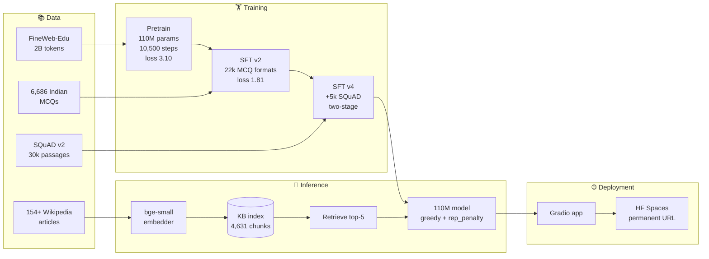
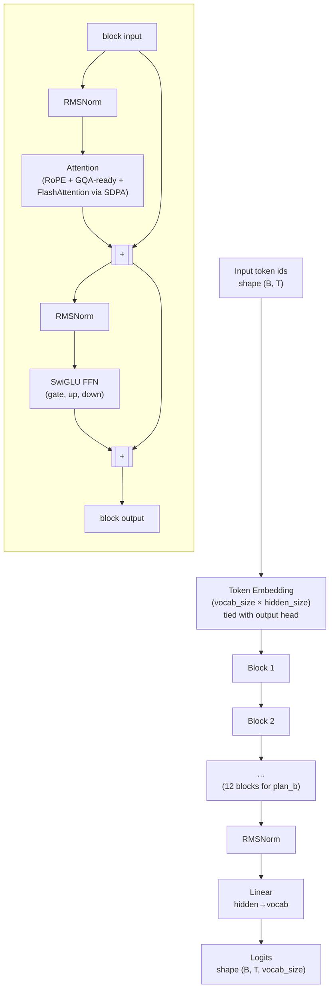
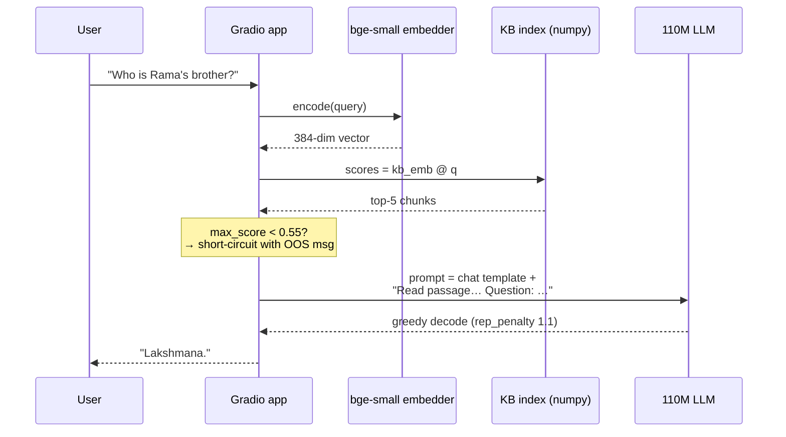
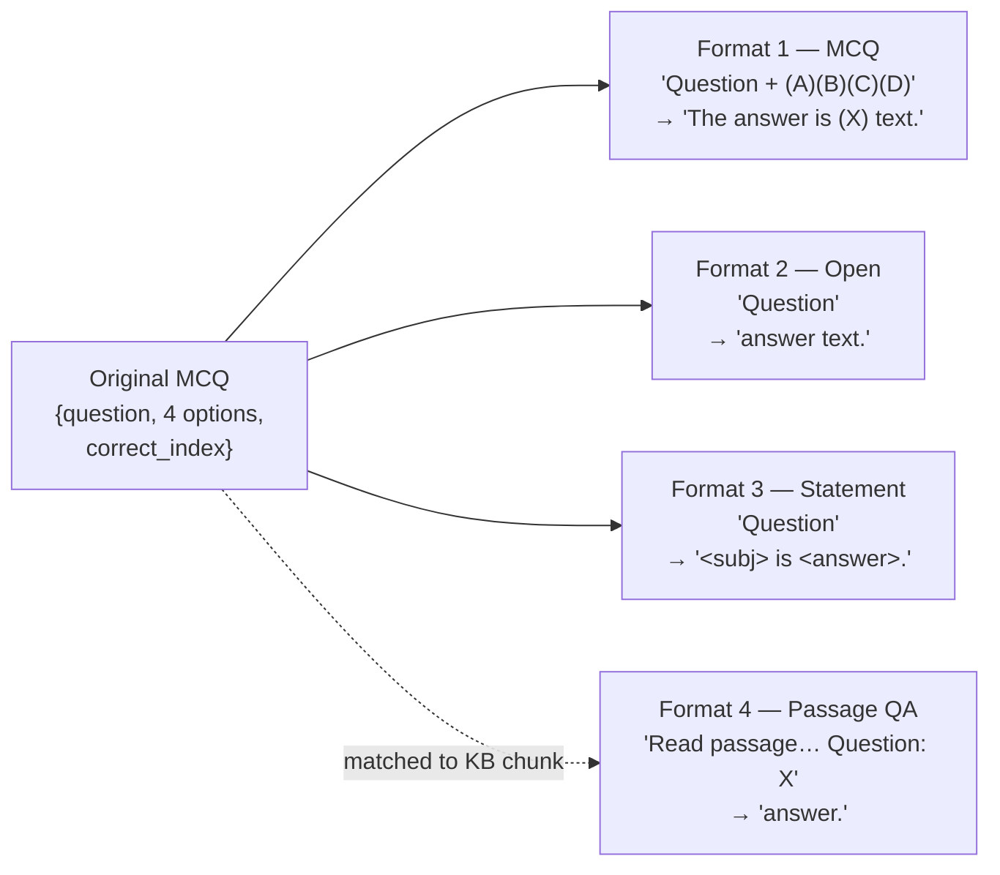
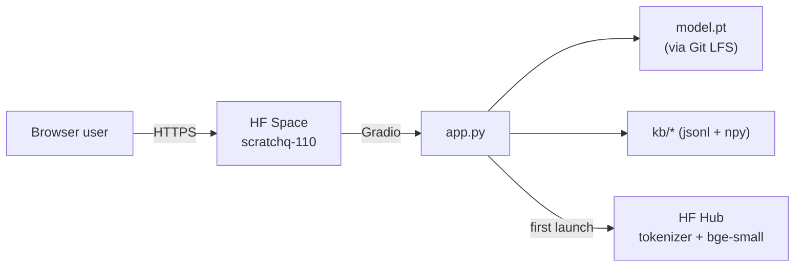

# Concepts behind this repo

A guided tour of what each piece is and why we use it. Assumes you know basic NN concepts (layers, weights, gradients, backprop).

## 0. Project at a glance



**Total spend: ~$5.40 of cloud compute.** Pretrain on a single RTX 3090 (~13h), SFT runs (~10–40 min each), KB build (~5 min), all on $0.14/hr GPUs from vast.ai. Inference deployed CPU-only on HuggingFace Spaces (free tier).

## 1. The big picture

We're training a **decoder-only Transformer** language model from scratch. Two phases:

1. **Pretraining**: feed the model billions of tokens of web text and have it predict the next token. It learns grammar, facts, basic reasoning — but only as a "text continuer," not a question-answerer. Output: a *base model*.
2. **Fine-tuning (SFT)**: take the base model and train it on `(prompt, response)` pairs so it learns to *respond* to instructions instead of continuing them. Output: an *instruct model*.

That's the whole pipeline. Everything else is engineering to make it fit on one GPU.

## 2. Tokens, not characters

Models don't see text as letters. A **tokenizer** chops text into ~32k unique sub-word "tokens" using BPE (byte-pair encoding):
```
"unbelievable"  →  ["un", "believ", "able"]   →  [443, 9301, 519]
```
We use Llama-2's tokenizer (32k vocab). Each token is mapped to an integer id; integers are what the model actually consumes.

**Why sub-words?** Pure characters → too many timesteps. Pure words → vocabulary explodes (millions of unseen ones). BPE is the sweet spot: common words are 1 token, rare words split into pieces.

## 3. The Transformer architecture (Llama-style)

Our model is in `model.py`. It's a stack of identical **blocks**, each containing two sublayers: attention + feed-forward. We use the modern "Llama" recipe:



### Token embedding (`tok_emb`)
A lookup table: each of 32000 token ids maps to a learned vector of `hidden_size` (768 for Plan B). Think of it as turning each word into a 768-dim point in "meaning space."

### Each Block has:
**RMSNorm → Attention → residual add → RMSNorm → FFN → residual add**

#### Attention (the magic)
Each token looks at every previous token and decides "how much do I care about each of you?" It's a weighted average over past tokens, where weights come from comparing **queries** (what I'm looking for) with **keys** (what I offer) — and we mix in the **values** (what I actually contribute).
- We split the work across `num_heads` parallel "attention heads" — each head learns to attend to a different kind of relationship (one head might track subject-verb, another might track long-range topic).
- **RoPE** (Rotary Position Embeddings): how the model knows token *position*. We rotate query/key vectors by an angle that depends on position — so two tokens at relative distance 5 always have the same rotation between them, regardless of where they are in the sequence. This generalizes to longer contexts than absolute position embeddings.
- **Causal mask**: a token can only see itself and previous tokens (set future positions to −∞ before softmax). This is what makes it a *language model*: you can't peek at the answer.
- We use PyTorch's `scaled_dot_product_attention` which automatically uses **FlashAttention-2** under the hood — a fused-kernel implementation that's ~2x faster and uses way less memory.

#### Feed-Forward (FFN) with SwiGLU
After attention, every token independently goes through a small MLP. The Llama version uses **SwiGLU**:
```
ffn(x) = down(silu(gate(x)) * up(x))
```
Two linear layers (gate, up) compute element-wise modulated activations, then a third (down) projects back. SwiGLU consistently beats vanilla ReLU FFN by ~0.5% loss for the same compute.

#### RMSNorm (instead of LayerNorm)
Normalizes each token's vector to unit RMS, then scales by a learned per-dim weight. Cheaper than LayerNorm (no mean subtraction), no quality loss. Used by Llama, Mistral, etc.

### Residual connections
Each sublayer's output is *added* to its input (`x = x + attn(norm(x))`). This is what lets you stack 12+ blocks without gradients vanishing — the gradient has a "highway" backward through the residuals.

### Tied embeddings
The token embedding (32000 → 768) and the final output projection (768 → 32000) share weights. Saves ~25M params, slightly improves quality.

### Final layer
After the last block we do RMSNorm, then a linear `lm_head` from 768 → 32000. The output is a **logit** for every token in the vocab — the model's score for "how likely is this the next token?" Apply softmax to get a probability distribution.

## 4. Training: predict the next token

The fundamental task: given tokens `[t0, t1, t2, ...]`, predict `t_{i+1}` at each position.
- Input: `[t0, t1, t2, t3]`
- Targets: `[t1, t2, t3, t4]` (shifted by one)
- Loss: cross-entropy between predicted distribution and true next token, averaged over all positions.

Because of the causal mask, we get N predictions from one forward pass — very efficient.

### Optimizer: AdamW
Adam adjusts the learning rate per-parameter based on running estimates of the gradient mean (`β1`) and variance (`β2`). **W**eight decay is regularization that pulls weights toward zero (decoupled in AdamW, hence the name). Standard choice. Betas (0.9, 0.95) are the LLM-tuned values.

### Learning rate schedule: warmup + cosine decay
- **Warmup** (first ~500 steps): linearly ramp LR from 0 → peak. Prevents the model from blowing up before Adam's running averages stabilize.
- **Cosine decay**: after warmup, smoothly decay LR to ~10% of peak following a cosine curve. Empirically the best schedule for one-shot pretraining.

### bf16 mixed precision
Weights stored in fp32; activations and matmuls in bf16 (brain float, same dynamic range as fp32 but half the bits). 2-3x speedup on Ampere/Ada GPUs with negligible quality cost.

### Gradient accumulation
Simulates a bigger batch size than fits in memory. Forward+backward 16 micro-batches, *accumulate* gradients, then step optimizer once. Effective batch = `micro_batch * grad_accum * seq_len`.

### Gradient checkpointing
Trades compute for memory: instead of caching every block's activations for backward, we re-compute them. ~30% slower but lets us fit a bigger model. We turn it on for Plan B.

### `torch.compile`
JIT-compiles the model graph to fused CUDA kernels. ~20-40% faster after a slow first step.

## 5. Data

We use **FineWeb-Edu** — a 1.3T-token subset of CommonCrawl filtered for educational quality by an LLM classifier. It's the cleanest large-scale pretraining corpus you can get for free right now. We tokenize once into binary `uint16` shards (vocab fits in 16 bits) and `mmap` them at training time so they appear as one big array but only the pages we touch are paged into RAM.

## 6. SFT (Supervised Fine-Tuning)

After pretraining you have a *base model* — completes text. To make it answer questions, we fine-tune on instruction data formatted as a chat:
```
<|system|>
You are a helpful assistant.<|end|>
<|user|>
What is the capital of France?<|end|>
<|assistant|>
The capital of France is Paris.<|end|>
```

Two key choices:
1. **Loss masking**: cross-entropy is applied *only* on assistant tokens. The user/system tokens contribute zero loss (we set targets to -100, the `ignore_index`). The model learns to *generate* responses, not memorize prompts.
2. **Lower learning rate** (~2e-5, 10x smaller than pretraining): the base model's weights are already "good," we just want to nudge them toward the response format. Big LR would catastrophically forget pretraining knowledge.

Dataset: `HuggingFaceH4/ultrachat_200k` — 200k synthetic-but-high-quality dialogues distilled from GPT-4.

## 7. What about LoRA / Unsloth?

Both are **fine-tuning accelerators** — not pretraining. They freeze the base model and train tiny low-rank adapters (a few % of params) instead of all of them. Useful when you have a 7B+ base model and want to fine-tune on a single GPU. They don't help us here because (a) we're training from scratch — there's no base model to attach LoRA to, (b) our 110M model already fits comfortably on one 3090 in full precision.

We *could* use LoRA on top of an existing model like Llama-3-8B to fine-tune on your data. That's a different project — much faster path to "answers questions well," but not "trained from scratch."

## 8. How loss numbers translate to quality

| Loss | What it means |
|---|---|
| ~10.4 | Random — uniform over 32k vocab (`ln 32000 ≈ 10.37`) |
| ~6 | Markov-chain-tier; sometimes valid bigrams |
| ~4-5 | English-shaped gibberish (our 5M smoke at 5.5) |
| ~3.5-4 | Grammatical sentences, often nonsensical content |
| ~3.0-3.5 | GPT-2-small quality; coherent paragraphs, weak reasoning |
| ~2.5 | TinyLlama / Pythia-1.4B; useful chatbot after SFT |
| ~2.0 | Frontier 7B+ models |

Loss is per-token cross-entropy in nats. Equivalently, **perplexity = exp(loss)** — the effective number of "options" the model is choosing among. Loss 3 ↔ perplexity 20.

## 9. Retrieval-Augmented Generation (RAG)

**The problem:** A 110M-param model trained on 2B tokens just doesn't have room to memorize most facts. We saw this directly — ask it "the capital of France" and it confidently says "Belgium" or loops forever. The model knows *language*, not *facts*.

**The insight:** Generating an answer from scratch requires the fact to be encoded in the weights. *Copying* an answer out of a passage you can read is a much easier task — small models can do it. So instead of asking the model to *recall*, we give it the relevant text right there in the prompt and ask it to *use* it.

That's RAG: at query time, **retrieve** the most relevant passages from a knowledge base, **augment** the prompt with them, then **generate** an answer.

```
              ┌─ user query ─┐
              ▼              │
       [embed query]         │
              ▼              │
       [vector search        │
        over KB index]       │
              ▼              ▼
   top-3 passages ─→ [system prompt + passages + user query] ─→ LLM ─→ answer
```

### Components in our build

**1. Knowledge base (`build_kb.py`)**
- Curated list of ~80 Wikipedia article seeds covering Indian mythology, history, geography, politics, defense, etc. — matched to our MCQ categories.
- Each article fetched via the MediaWiki API (free, no auth needed).
- Each article split into ~200-word chunks. We pick this size because it fits comfortably inside the model's 1024-token context alongside the system prompt and user message, and because passages this small tend to focus on one fact each — better retrieval signal.

**2. Embeddings (`BAAI/bge-small-en-v1.5`)**
- A separate, tiny model (33M params) that converts any text into a fixed-length vector (here: 384 dimensions).
- Trained so that *semantically similar text* lands at nearby points in this 384-dim space.
- "Who is Rama's brother?" and "Lakshmana, brother of Rama, is..." get nearly identical vectors. "Capital of France" and "Photosynthesis" land far apart.
- We embed every chunk once at build time → save the (N, 384) matrix to disk.
- We normalize embeddings to unit length, which makes **cosine similarity** equivalent to a simple dot product (much faster).

**3. Retriever (in `gradio_app.py`)**
- At query time:
  1. Embed the user's question with the same encoder.
  2. Compute `scores = kb_embeddings @ query_embedding` — one matrix-vector multiply, milliseconds.
  3. Argsort, take top-k (k=3).
- We don't need fancy vector DBs (FAISS, Pinecone) at this scale — ~500 vectors fits in 800KB.

**4. Prompt augmentation — system prompt vs user message**

We tried two formats. Pick by what the model was actually SFT'd on.

**v1 (didn't work for us):** put context in `<|system|>`. Sounds clean — system prompt is "facts the model can use." But our SFT data trained the model on a *short* fixed system prompt (`"You are a helpful assistant."`). When we replaced it with 600 tokens of Wikipedia, the model treated it as out-of-distribution noise and *ignored the context*, hallucinating answers anyway.

**v2 (what works):** inline the retrieved passage into the user message:
```
<|system|>
You are a helpful assistant.<|end|>
<|user|>
Read the passage and answer the question.

Lakshmana: Lakshmana is the loyal younger brother of Rama, son of King Dasharatha…

Question: Who is Rama's brother?<|end|>
<|assistant|>
Lakshmana.<|end|>
```

Why v2 works: this format mirrors **SQuAD-style extractive QA** (which we explicitly added to SFT — see §11), and it doesn't violate the short-system-prompt contract the model learned.

**Lesson:** match your inference prompt format *exactly* to your training data format. Tiny models are extremely sensitive — even `"the following passage"` vs `"the passage"` can change behavior.

### Why RAG works on small models

The hardest task for a small LM is **closed-book recall** — produce a fact from weights alone. RAG turns that into **open-book extraction** — copy a span from given text. The latter is much easier:
- 110M models can usually do open-book extraction ~50-70% of the time
- 110M models can do closed-book recall on niche facts ~5-15% of the time

That's why a $0.20 RAG layer dramatically out-performs a $100 continued-pretraining run on the same model.

### Caveats / limits
- **Garbage retrieval = garbage answer.** If the KB doesn't contain the fact (e.g., "Capital of America" — we only seeded Indian topics), the model still hallucinates from whatever Indian article was returned. We mitigated by adding an **out-of-scope detector**: if the top retrieval cosine score is < 0.55, reply with a polite "I'm specialized for Indian general knowledge" and skip generation entirely.
- **The model still has to read.** A 110M model with a context window full of 600 tokens of retrieved text is slow and sometimes loses focus. Bigger context = quadratic attention cost.
- **Retrieval ≠ understanding.** If the question is "compare A and B" and our retrieved chunks each only mention A *or* B, the model can't synthesize. RAG is great for factoid Q&A, weaker for reasoning.
- **No re-ranking, no query rewriting.** Production RAG systems do those. We don't because we want a clean teaching example.
- **Embedding bias.** "First PM of India?" retrieves Indira Gandhi (not Nehru) because her article opens with *"...the first female Prime Minister of India"* which scores closer to that query. We mitigated with `k=5` so Nehru lands somewhere in the top 5.



## 10. Data augmentation for SFT — format diversification

The naive SFT approach was just to feed our 5,686 MCQs to the model in their original format:

```
user:      Question (history): Who was the first PM of India?
           (A) Nehru  (B) Patel  (C) Gandhi  (D) Bose
assistant: The answer is (A) Nehru.
```

This taught the model **only one input pattern**: a question followed by 4 options. When real users typed `"Who was the first PM of India?"` *without* options, the model had no template and produced gibberish.

**Fix: programmatically reformat each MCQ into multiple Q&A formats.** Each MCQ becomes 3 SFT examples:



Effect: **5,686 MCQs → 22,415 training examples** (roughly 4× expansion). Each MCQ teaches the model 3-4 different "this is how you answer questions" patterns.

The statement format (#3) uses cheap regex-based templates: `"What is the capital of X?"` + `"Paris"` → `"The capital of X is Paris."`. Crude but enough.

Format-4 (passage-grounded extraction) is the secret sauce that makes RAG work — see §11.

## 11. SQuAD: explicit extractive-QA training

After format diversification, the model could *answer* questions but still hallucinated heavily even with retrieved context. The fix: **explicitly train it on `(passage, question, span)` triples** — exactly what RAG asks it to do at inference time.

We mixed in **30,000 examples from SQuAD v2** (Stanford's reading-comprehension dataset). Each becomes:

```
user:      Read the passage and answer the question.

           {200-word Wikipedia paragraph}

           Question: {question}
assistant: {span from the passage}.
```

That's the *same template* gradio uses at runtime when RAG is on. Training on it teaches the model "given a relevant passage, extract the answer" — a much easier skill than closed-book recall.

**Lesson learned the hard way: catastrophic forgetting.** Our first try (SFT v3) mixed all data in one big run. Result: the model learned SQuAD's *descriptive* answer style (e.g., for "who is Mary Kom" it'd say *"the first female boxer to win the World Amateur Championship"* instead of *"Mary Kom"*). It forgot the direct-name format from MCQs.

**Fix: two-stage SFT (v4).** Train the Indian MCQ specialization first → then *briefly* tune on SQuAD at a much lower learning rate (`lr=1e-5` vs `2e-5`). The lower LR is the trick: it nudges the model toward extractive behavior without overwriting the direct-name format.

| Version | Training data | LR | Result |
|---|---|---|---|
| v1 | UltraChat + raw MCQs | 2e-5 | Format works, but only on MCQ-shaped prompts |
| v2 | Augmented MCQs (3 formats) | 2e-5 | Direct-name answers work |
| v3 | v2 + 30k SQuAD, 1 epoch | 2e-5 | Catastrophic forgetting → descriptive answers, lost names |
| v4 | v2 ckpt + 5k SQuAD, 1 epoch | **1e-5** | Best — names preserved, extraction improved |

## 12. Decoding strategy for small models

Common wisdom from frontier LLMs (`temperature=0.7-0.8`, `top_p=0.9`) **does not transfer to 110M models on factual Q&A**. We empirically tested:

| Decoding | Chat accuracy on 10 Indian Q&A |
|---|---:|
| Sample, T=0.8, top_k=50 | ~0/10 (gibberish, e.g. "Vijayadhana" for Rama's brother) |
| Sample, T=0.4, top_k=20 | ~0-1/10 |
| **Greedy (T=1.0, top_k=1) + rep_penalty 1.1** | **~3/10** |

Why: at 110M params, the *correct* token usually dominates the probability distribution by a small margin. Sampling at any non-trivial temperature lets the model pick a plausible-but-wrong neighbor. **Greedy is the right default for small-model factual generation.**

The light repetition penalty (1.1) is essential because pure greedy decoding can lock into loops (`"space-based space-based space-based…"`). The CTRL paper formulation: divide logit by penalty if positive, multiply if negative — applied to all tokens already in the output.

## 13. Comparative benchmarking — proving "specialization beats scale"

To make a defensible resume claim, we benchmarked our 110M against open baselines on the same 200-MCQ holdout, with two metrics:

- **LL accuracy** — log-likelihood-score each option `(A/B/C/D)`, pick highest. This is the standard MMLU-style metric and what `lm-evaluation-harness` uses.
- **Generation accuracy** — free-form generate, parse the first `(A/B/C/D)` letter from the response. Closer to what users see in chat.

| Model | Params | LL acc | Gen acc | $ to train |
|---|---:|---:|---:|---:|
| **ours (SFT'd)** | **110M** | **36.5%** | **33.5%** | **~$2** |
| GPT-2 small | 124M | 22.0% | 14.0% | ~$5k (2019) |
| GPT-2 medium | 355M | 17.5% | 15.5% | ~$15k (2019) |
| Pythia-410M | 405M | 26.5% | 18.0% | ~$30k (2023) |
| (random) | — | 25.0% | 25.0% | $0 |

The headline: **a $2 specialized model beats a 3× larger generalist (GPT-2 medium) by 19 percentage points.** This is the core "story" of the project — domain specialization is a real lever even at small scale.

**Important honesty:** the 36.5% LL number doesn't mean 36.5% of chat replies are correct — chat-mode (with RAG, sampling noise, stop-condition issues) is more like ~30%. The metrics measure different tasks.

## 14. Where the 110M ceiling actually is

After all the above, the realistic chat-mode accuracy on Indian-context factoid Q&A is about **30%**. To go beyond this requires one of:

1. **A bigger base model.** ~1B params with ~300B training tokens (TinyLlama-tier) would reliably know "Rama's brother is Lakshmana" without RAG. Realistic compute cost: ~$6,000+ on H100 spot pricing.
2. **Fine-tuning an existing 1-3B instruct model** (Qwen2.5-1.5B, Llama-3.2-1B). LoRA on our same data → ~80%+ accuracy for a few hundred dollars at most. *But* this isn't "trained from scratch" — different story.
3. **Better RAG with a larger encoder + reranking.** Helps maybe 5-10pp at our scale.

We deliberately stopped at #1 because the goal was to prove the from-scratch pipeline works, not to ship a SOTA chatbot. Resume framing: **"the specialized small model beats unspecialized models 3× its size."**

## 15. Deployment

We deployed to **HuggingFace Spaces** (free CPU tier — 2 vCPU, 16GB RAM):



Storage: weights + KB live in the Space repo via Git LFS. App startup takes ~30-60s (loads model into RAM, downloads embedder + tokenizer to local cache on cold-start). Inference: ~20 tok/s CPU. Free tier sleeps after a few minutes idle and warms back up on the next visit.

Public URL is permanent: `https://huggingface.co/spaces/sumitkClasses/scratchq-110` — exactly what a recruiter wants to click.

## 16. Evaluation

After training, we'll run `lm-evaluation-harness` on standard benchmarks:
- **HellaSwag**: pick the right sentence completion (commonsense)
- **ARC-easy / ARC-challenge**: grade-school science MCQ
- **WinoGrande**: pronoun resolution / commonsense
- **PIQA**: physical commonsense
- **BoolQ**: yes/no reading comprehension

For a 110M model expect HellaSwag ~30-35% (random=25), ARC-easy ~40%. MMLU is essentially noise at this scale. The Open LLM Leaderboard accepts submissions and gives you a public score.
